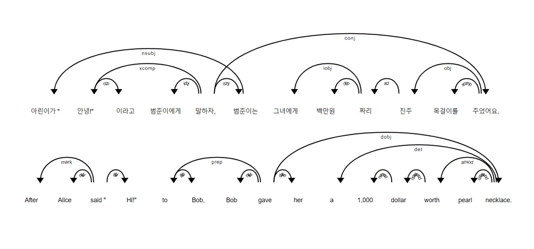
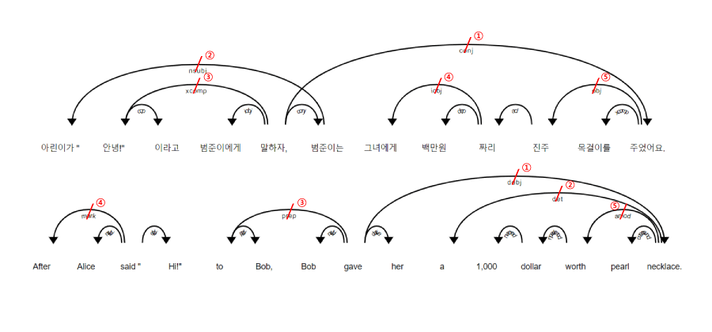

# spaCy-space
- `spaCy`를 사용한 띄어읽기
- "intra-splitting" sentences at natural pauses via `spaCy`

---

## 프로젝트 의도 motivation
- 문단에서 문장을 분리하는 좋은 오픈소스 라이브러리들은 많이 존재합니다. 한국어 라이브러리로는 [`korean-sentence-segmenation`](https://github.com/hyunwoongko/kss), 영어 라이브러리로는 [`sentencex`](https://github.com/wikimedia/sentencex), 다국어 라이브러리로는 [`nltk`](https://github.com/nltk/nltk)와 [`spaCy`](https://github.com/explosion/spaCy) 같은 라이브러리들이 대표적입니다. There are many good open-source libraries that separate sentences from paragraphs. For Korean, commonly used libraries include [`korean-sentence-segmenation`](https://github.com/hyunwoongko/kss), for English, [`sentencex`](https://github.com/wikimedia/sentencex), and for multilingual support, [`nltk`](https://github.com/nltk/nltk) and [`spaCy`](https://github.com/explosion/spaCy).
- 하지만, 경우에 따라 단일 문장 또한 적절한 길이로 분절해줘야 하는 경우가 있습니다. 예를 들어, Text-to-Speech 모델에 너무 긴 단일 문장을 넣으면 메모리 초과 문제가 발생할 수 있어, 적당한 길이의 문구들로 단일 문장들을 잘라서 모델에 넣어줘야 합니다. However, there are cases where even a single sentence needs to be segmented into appropriate lengths. For example, if a speech synthesis model is given a single sentence that is too long, it may cause memory overflow issues. In such cases, the single sentence must be segmented into appropriate lengths before fed into the model.
- 이를 위해서, 여러 방법을 사용할 수 있습니다. To achieve this, there are several methods:
  1. [`textwrap`](https://docs.python.org/3/library/textwrap.html)과 같은 모듈을 사용하거나 직접 구현하여 문장 길이가 특정 길이를 넘어가면 분절. Use modules such as `textwrap` or implement your own method to segment sentences based on a specific length.
  2. '.', ','과 같은 구두점 또는 "그리고", "하지만"과 같은 접속사에서 분절. Segment sentences based on punctuation marks such as periods (.) and commas (,) or conjunctions such as "and" and "but."
  3. 모델을 학습하여 자연스러운 띄어읽기 예측. Train a model to predict natural pause points.
    - 관련 연구 Reference Work 1) Kim, et al., *"Korean Prosody Phrase Boundary Prediction Model for Speech Synthesis Service in Smart Healthcare"*, doi:[10.3390/electronics10192371](https://doi.org/10.3390/electronics10192371)
    - 관련 연구 Reference Work 2) Lee, et al., *"Cross-Lingual Transfer Learning for Phrase Break Prediction with Multilingual Language Model"*, doi:[10.48550/arXiv.2306.02579](https://doi.org/10.48550/arXiv.2306.02579)
  4. **이 프로젝트**를 사용하여 문장 사이에 적당한 띄어읽기 추가. Use **this project** to add spaces in-between single sentences, and achieve somewhat satisfactory performance.

## 방법론 Approach
- 이 토이 프로젝트는 `spaCy`의 의존 구조 분석 기능을 활용하여 띄어읽기를 구현합니다. This toy project depends on the dependency parsing feature of `spaCy` to add natural spaces in-between single sentences.
    
- 의존 구조 트리의 엣지 정보들을 모두 저장한 뒤, 길이가 긴 순서대로, 문장의 왼쪽에서부터 오른쪽 순서대로 엣지들을 분절하여 의존 구조 트리를 여러 개의 서브트리로 나눕니다. Stores all edge information of each dependency tree from corresponding sentences, and remove the edges first by their length and then in order from left to right, which would divide each dependency trees into multiple subtrees.
    

&nbsp;

## 사용방법 How to use

### 설치방법 Installation
- `pip install spacy-space`
  - [PyPI](https://pypi.org/project/spacy-space/#history) 또는 [GitHub](https://github.com/shhommychon/spacy-space/releases)을 통해서 버젼 정보를 확인할 수 있습니다. You can check version infos in both [PyPI](https://pypi.org/project/spacy-space/#history) and [GitHub](https://github.com/shhommychon/spacy-space/releases).


### 사용할 모델 코드 확인 Check the codes of the model for your need
```python
from spacy-space import SplitEngine

print(SplitEngine.get_available_lang_codes())
# >>> ['ca', 'zh', 'hr', 'da', 'nl', 'en', 'fi', 'fr', 'de', 'el', 'it', 'ja', 'ko', 'lt', 'mk', 'nb', 'pl', 'pt', 'ro', 'ru', 'sl', 'es', 'sv', 'uk']
print(SplitEngine.get_available_size_codes("en"))
# >>> ['sm', 'md', 'lg', 'trf']
```
- `spacy-space`는 `spaCy`가 지원하는 모든 언어들에 대하여 띄어읽기 기능을 제공하도록 의도 되었습니다. [spaCy 공식 다큐멘테이션](https://spacy.io/usage/models#languages)에서 전체 지원 언어 목록을 확인하세요. `spacy-space` is intended to support all languages `spaCy` does. Check the [official spaCy documentation](https://spacy.io/usage/models#languages) for full details on language support.


### 띄어읽기 Intra-splitting sentences

- `SplitEngine`을 초기화 한 후, 긴 텍스트를 넣어주세요. Initialize `SplitEngine` and load any long text.
```python
from spacy-space import SplitEngine

# ex) English
eng_splitter = SplitEngine("en", "sm")
eng_splitter.load_document("""blah blah? blah blah blah... blah blah!""")
```

- `load_document()` 메서드를 통해 입력된 텍스트는 `spaCy`에 의해 바로 문장 단위로 쪼개져서 저장됩니다. 따라서, `load_document()`이 문제 없이 끝났다면, 단순 문장 분리에는 별도로 연산 시간이 더 소요되지 않습니다. The text loaded by `load_document()` method is splitted into sentences by `spaCy`. If `load_document()` ended with no problem, no extra operation will be required to obtain the splitted sentences from loaded text.
```python
eng_splitter.to_sentences()
# >>> ... List of sentence strings ...
```

1. 각 문장을 특정 개수의 문구들로 분리하려는 경우 In case when you require each sentences divided into certain number of chunks:
```python
eng_splitter.to_chunks(num_chunk=2)
# - or -
eng_splitter.to_chunks_by_num(2)
```

2. 각 문장을 분리할 때 문구들의 최대 길이를 특정 길이로 제한하는 경우 In case when you require each sentences divided into chunks with maximum length limits:
```python
eng_splitter.to_chunks(len_chunk=40)
# - or -
eng_splitter.to_chunks_by_len(40)
```
  - 각 언어 별로 적절한 길이 제한 값은 차이가 있을 수 있습니다. Note that appropriate maximum length may differ between languages.

